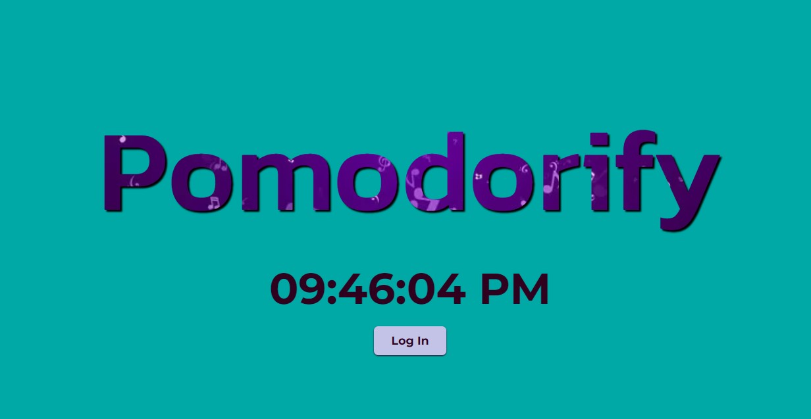

# Pomodorify

Reminder: This little project needs a Spotify premium account for use the Spotify API

Get your variables from your the dashboard Spotify app for you .env
```
SPOTIFY_CLIENT_ID=your_spotify_client_id
SPOTIFY_CLIENT_SECRET=your_spotify_client_secret
SPOTIFY_REDIRECT_URI=your_spotify_redirect_uri
```

Then
```
npm install
npm run dev
```

